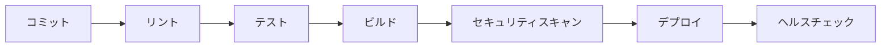

# 設計書

## 概要

AnthropicのProject Vend（自動販売機）のシミュレーターを作成するための設計書です。リアルな自動販売機ハードウェアを構築する前に、ソフトウェアシミュレーターで自動販売機の動作、安全性、ユーザーエクスペリエンスをテストします。シミュレーターは実際の自動販売機の動作を忠実に再現し、研究開発に活用できる環境を提供します。

## アーキテクチャ

### AIエージェント自動販売機システムの構造（完全版）

```
ai-vending-system/
├── src/                        # メインソースコード
│   ├── __init__.py
│   ├── main.py                 # FastAPI エントリーポイント
│   ├── config/                 # 設定モジュール
│   │   ├── __init__.py
│   │   ├── settings.py         # システム設定
│   │   ├── ai_config.py        # AI設定とガードレール
│   │   └── security.py         # セキュリティ設定
│   ├── agents/                 # AIエージェント
│   │   ├── __init__.py
│   │   ├── vending_agent.py    # メイン販売エージェント
│   │   ├── procurement_agent.py # 調達エージェント
│   │   ├── customer_agent.py   # 顧客対話エージェント
│   │   └── analytics_agent.py  # 分析エージェント
│   ├── models/                 # データモデル
│   │   ├── __init__.py
│   │   ├── product.py          # 商品モデル
│   │   ├── transaction.py      # 取引モデル
│   │   ├── inventory.py        # 在庫モデル
│   │   ├── supplier.py         # 仕入れ先モデル
│   │   ├── customer.py         # 顧客モデル
│   │   ├── conversation.py     # 会話履歴モデル
│   │   ├── journal_entry.py    # 仕訳エントリモデル
│   │   └── account.py          # 勘定科目モデル
│   ├── services/               # ビジネスロジック
│   │   ├── __init__.py
│   │   ├── inventory_service.py # 在庫管理（自販機+保管庫）
│   │   ├── payment_service.py  # Stripe決済処理
│   │   ├── dispense_service.py # 商品排出制御
│   │   ├── procurement_service.py # 調達管理
│   │   ├── web_search_service.py # Web検索（価格比較）
│   │   └── conversation_service.py # 顧客対話管理
│   ├── procurement/            # 調達システム
│   │   ├── __init__.py
│   │   ├── price_monitor.py    # 価格監視
│   │   ├── supplier_finder.py  # 仕入れ先検索
│   │   └── order_generator.py  # 発注指示書生成
│   ├── customer_engagement/    # 顧客エンゲージメント
│   │   ├── __init__.py
│   │   ├── conversation_engine.py # 会話エンジン
│   │   ├── coupon_manager.py   # クーポン管理
│   │   └── preference_analyzer.py # 嗜好分析
│   ├── accounting/             # 会計システム
│   │   ├── __init__.py
│   │   ├── journal_entry.py    # 仕訳処理
│   │   ├── ledger_manager.py   # 総勘定元帳管理
│   │   ├── financial_reports.py # 財務諸表生成
│   │   └── management_accounting.py # 管理会計
│   ├── analytics/              # 分析システム
│   │   ├── __init__.py
│   │   ├── event_tracker.py    # 事象追跡
│   │   ├── anomaly_detector.py # 異常検出
│   │   ├── report_generator.py # レポート生成
│   │   └── prediction_engine.py # 予測エンジン
│   ├── tablet/                 # タブレットUI
│   │   ├── __init__.py
│   │   ├── interface.py        # タブレットインターフェース
│   │   ├── chat_interface.py   # チャットインターフェース
│   │   └── templates/          # HTMLテンプレート
│   ├── dashboard/              # ダッシュボードシステム
│   │   ├── __init__.py
│   │   ├── dashboard_service.py # ダッシュボードサービス
│   │   ├── metrics_collector.py # メトリクス収集
│   │   └── chart_generator.py  # チャート生成
│   ├── api/                    # API エンドポイント
│   │   ├── __init__.py
│   │   ├── vending.py          # 販売API
│   │   ├── tablet.py           # タブレットAPI
│   │   ├── procurement.py      # 調達API
│   │   ├── customer.py         # 顧客API
│   │   ├── accounting.py       # 会計API
│   │   ├── dashboard.py        # ダッシュボードAPI
│   │   └── admin.py            # 管理API
│   └── utils/                  # ユーティリティ
│       ├── __init__.py
│       ├── logger.py           # セキュアログ
│       ├── validators.py       # 入力検証
│       └── web_scraper.py      # Web検索ユーティリティ
├── tests/                      # テストファイル
│   ├── __init__.py
│   ├── test_vending_flow.py    # 購入フローテスト
│   ├── test_procurement.py     # 調達システムテスト
│   ├── test_customer_chat.py   # 顧客対話テスト
│   ├── test_analytics.py       # 分析システムテスト
│   └── conftest.py
├── data/                       # データファイル
│   ├── suppliers/              # 仕入れ先データ（JSON）
│   ├── conversations/          # 会話ログ（NoSQL/MongoDB）
│   ├── analytics/              # 分析データ（JSON）
│   ├── accounting/             # 会計データ（SQLite）
│   └── reports/                # 生成レポート（JSON/PDF）
├── static/                     # 静的ファイル
│   ├── css/
│   ├── js/
│   ├── dashboard/              # ダッシュボード用ファイル
│   │   ├── index.html          # メインダッシュボード
│   │   ├── dashboard.js        # ダッシュボードロジック
│   │   └── dashboard.css       # ダッシュボードスタイル
│   └── images/
├── docs/                       # ドキュメント
│   ├── system_overview.md      # システム概要
│   ├── procurement_flow.md     # 調達フロー
│   ├── customer_engagement.md  # 顧客エンゲージメント
│   ├── accounting_system.md    # 会計システム仕様
│   └── analytics_spec.md       # 分析仕様
├── requirements.txt            # Python依存関係
├── pyproject.toml              # プロジェクト設定
├── .env.example                # 環境変数テンプレート
├── .gitignore                  # Git除外設定
└── README.md                   # AIエージェント自動販売機説明
```

### アーキテクチャ原則

1. **AIエージェント自律性**: AIエージェントが自律的に意思決定し、自動販売機を制御
2. **AI安全性第一**: AIの行動制約、安全ガードレール、異常検出システム
3. **拡張可能なデータ基盤**: 将来的なデータ充実と検証プランに対応
4. **モジュラー設計**: 新しいAI機能やテストシナリオの容易な追加
5. **包括的監視**: AIの意思決定プロセス、システム状態、安全性指標の追跡
6. **セキュリティ重視**: AIモデルAPIキーと決済情報の完全保護

## コンポーネントと インターフェース

### 1. メインアプリケーション (`src/main.py`)

```python
# src/main.py - 自動販売機シミュレーターAPI
from fastapi import FastAPI, HTTPException
from fastapi.staticfiles import StaticFiles
from src.config.settings import settings
from src.api import simulator, products, transactions, monitoring
from src.simulator.vending_machine import VendingMachineSimulator

app = FastAPI(
    title="Vending Machine Simulator",
    description="Anthropic PJ Vend Simulator for research and development",
    version="1.0.0"
)

# グローバルシミュレーターインスタンス
vending_simulator = VendingMachineSimulator()

# API ルーター登録
app.include_router(simulator.router, prefix="/api/v1/simulator", tags=["simulator"])
app.include_router(products.router, prefix="/api/v1/products", tags=["products"])
app.include_router(transactions.router, prefix="/api/v1/transactions", tags=["transactions"])
app.include_router(monitoring.router, prefix="/api/v1/monitoring", tags=["monitoring"])

# 静的ファイル（シミュレーターUI）
if settings.enable_frontend:
    app.mount("/static", StaticFiles(directory="frontend/static"), name="static")

@app.get("/")
async def root():
    return {
        "message": "Vending Machine Simulator API",
        "status": "operational",
        "version": "1.0.0",
        "simulator_state": await vending_simulator.get_state()
    }

@app.get("/health")
async def health_check():
    return {
        "status": "healthy", 
        "machine_id": settings.machine_id,
        "simulator_running": vending_simulator.is_running()
    }

@app.on_event("startup")
async def startup_event():
    """シミュレーター起動時の初期化"""
    await vending_simulator.initialize()
    
@app.on_event("shutdown")
async def shutdown_event():
    """シミュレーター終了時のクリーンアップ"""
    await vending_simulator.shutdown()
```

### 2. 包括的なAIエージェントシステム (`src/agents/`)

```python
# src/agents/procurement_agent.py
from typing import Dict, List
from src.services.web_search_service import WebSearchService
from src.services.procurement_service import ProcurementService
from src.procurement.supplier_finder import SupplierFinder
from src.procurement.order_generator import OrderGenerator

class ProcurementAgent:
    def __init__(self):
        self.web_search = WebSearchService()
        self.procurement_service = ProcurementService()
        self.supplier_finder = SupplierFinder()
        self.order_generator = OrderGenerator()
        self.anthropic_client = None
    
    async def monitor_inventory_and_procure(self) -> Dict:
        """在庫監視と自動調達"""
        # 在庫レベルチェック
        low_stock_items = await self.procurement_service.get_low_stock_items()
        
        procurement_results = []
        for item in low_stock_items:
            # Web検索で価格比較
            suppliers = await self.web_search.find_suppliers(item["product_name"])
            
            # 最適仕入れ先選定
            best_supplier = await self.supplier_finder.select_best_supplier(
                suppliers, item["required_quantity"]
            )
            
            # 発注指示書生成
            order_instruction = await self.order_generator.create_order_instruction(
                item, best_supplier
            )
            
            procurement_results.append({
                "product": item["product_name"],
                "supplier": best_supplier,
                "order_instruction": order_instruction,
                "status": "pending_human_approval"
            })
        
        return {"procurement_results": procurement_results}

# src/agents/customer_agent.py
class CustomerAgent:
    def __init__(self):
        self.conversation_service = ConversationService()
        self.coupon_manager = CouponManager()
        self.preference_analyzer = PreferenceAnalyzer()
        self.anthropic_client = None
    
    async def engage_customer(self, customer_id: str) -> Dict:
        """顧客との定期的エンゲージメント"""
        # 顧客履歴分析
        customer_profile = await self.preference_analyzer.analyze_customer(customer_id)
        
        # AI会話生成
        conversation_prompt = self._build_engagement_prompt(customer_profile)
        
        ai_response = await self.anthropic_client.messages.create(
            model="claude-3-sonnet-20240229",
            messages=[{"role": "user", "content": conversation_prompt}],
            max_tokens=500
        )
        
        conversation_content = self._parse_ai_response(ai_response)
        
        # 新商品希望の収集
        if "new_product_request" in conversation_content:
            await self.conversation_service.record_product_request(
                customer_id, conversation_content["new_product_request"]
            )
        
        # 割引クーポン生成
        if customer_profile["loyalty_score"] > 0.7:
            coupon = await self.coupon_manager.generate_personalized_coupon(
                customer_id, customer_profile
            )
            conversation_content["coupon"] = coupon
        
        return conversation_content
    
    def _build_engagement_prompt(self, customer_profile: Dict) -> str:
        """顧客エンゲージメント用プロンプト構築"""
        return f"""
        顧客プロフィール: {customer_profile}
        
        この顧客と自然な会話を行い、以下を実現してください：
        1. 購入履歴に基づく商品推奨
        2. 新商品の希望を聞く
        3. 適切な場合は割引の提案
        4. 親しみやすく経済的な交流を促進
        
        JSON形式で応答してください：
        {{
            "greeting": "挨拶メッセージ",
            "product_recommendation": "商品推奨",
            "new_product_inquiry": "新商品希望の質問",
            "special_offer": "特別オファー（該当する場合）"
        }}
        """

# src/agents/analytics_agent.py
class AnalyticsAgent:
    def __init__(self):
        self.event_tracker = EventTracker()
        self.anomaly_detector = AnomalyDetector()
        self.report_generator = ReportGenerator()
        self.prediction_engine = PredictionEngine()
    
    async def analyze_system_events(self) -> Dict:
        """システム事象の包括的分析"""
        # 全事象の収集
        events = await self.event_tracker.get_recent_events()
        
        # 異常検出
        anomalies = await self.anomaly_detector.detect_anomalies(events)
        
        # 統計分析
        statistics = await self._calculate_statistics(events)
        
        # 予測生成
        predictions = await self.prediction_engine.generate_predictions(events)
        
        # 包括レポート生成
        report = await self.report_generator.create_comprehensive_report({
            "events": events,
            "anomalies": anomalies,
            "statistics": statistics,
            "predictions": predictions
        })
        
        return report
    
    async def _calculate_statistics(self, events: List[Dict]) -> Dict:
        """統計計算"""
        return {
            "sales_metrics": self._calculate_sales_metrics(events),
            "inventory_efficiency": self._calculate_inventory_efficiency(events),
            "customer_satisfaction": self._calculate_customer_satisfaction(events),
            "cost_analysis": self._calculate_cost_analysis(events)
        }

# src/services/inventory_service.py
class InventoryService:
    def __init__(self):
        self.vending_machine_inventory = {}  # 自販機内在庫
        self.storage_inventory = {}          # 保管庫在庫
    
    async def get_total_inventory(self, product_id: str) -> Dict:
        """総在庫量取得（自販機+保管庫）"""
        vending_stock = self.vending_machine_inventory.get(product_id, 0)
        storage_stock = self.storage_inventory.get(product_id, 0)
        
        return {
            "product_id": product_id,
            "vending_machine_stock": vending_stock,
            "storage_stock": storage_stock,
            "total_stock": vending_stock + storage_stock
        }
    
    async def plan_restocking(self) -> List[Dict]:
        """補充計画立案"""
        restocking_plan = []
        
        for product_id in self.vending_machine_inventory:
            vending_stock = self.vending_machine_inventory[product_id]
            storage_stock = self.storage_inventory.get(product_id, 0)
            
            if vending_stock < 5 and storage_stock > 0:  # 自販機在庫少、保管庫在庫あり
                transfer_amount = min(storage_stock, 10 - vending_stock)
                restocking_plan.append({
                    "product_id": product_id,
                    "transfer_amount": transfer_amount,
                    "priority": "high" if vending_stock < 2 else "medium"
                })
        
        return restocking_plan

### 3. 会計システム (`src/accounting/`)

```python
# src/accounting/journal_entry.py
from datetime import datetime
from typing import List, Dict
from src.models.journal_entry import JournalEntry, AccountingEntry

class JournalEntryProcessor:
    def __init__(self):
        self.chart_of_accounts = {
            "1001": "現金",
            "1101": "商品",
            "2001": "買掛金",
            "4001": "売上高",
            "5001": "仕入高",
            "6001": "販売費及び一般管理費"
        }
    
    async def record_sale(self, transaction_data: Dict) -> JournalEntry:
        """売上仕訳の自動生成"""
        amount = transaction_data["amount"]
        
        # 借方：現金、貸方：売上高
        entries = [
            AccountingEntry(
                account_code="1001",
                account_name="現金",
                debit_amount=amount,
                credit_amount=0
            ),
            AccountingEntry(
                account_code="4001", 
                account_name="売上高",
                debit_amount=0,
                credit_amount=amount
            )
        ]
        
        journal_entry = JournalEntry(
            date=datetime.now(),
            description=f"商品売上 - {transaction_data['product_name']}",
            entries=entries,
            reference_id=transaction_data["transaction_id"]
        )
        
        await self._save_journal_entry(journal_entry)
        return journal_entry
    
    async def record_purchase(self, procurement_data: Dict) -> List[JournalEntry]:
        """仕入仕訳の自動生成"""
        amount = procurement_data["total_amount"]
        
        # 1. 仕入時：借方：仕入高、貸方：買掛金
        purchase_entries = [
            AccountingEntry(
                account_code="5001",
                account_name="仕入高", 
                debit_amount=amount,
                credit_amount=0
            ),
            AccountingEntry(
                account_code="2001",
                account_name="買掛金",
                debit_amount=0,
                credit_amount=amount
            )
        ]
        
        # 2. 在庫計上：借方：商品、貸方：仕入高
        inventory_entries = [
            AccountingEntry(
                account_code="1101",
                account_name="商品",
                debit_amount=amount,
                credit_amount=0
            ),
            AccountingEntry(
                account_code="5001",
                account_name="仕入高",
                debit_amount=0,
                credit_amount=amount
            )
        ]
        
        journal_entries = [
            JournalEntry(
                date=datetime.now(),
                description=f"商品仕入 - {procurement_data['supplier_name']}",
                entries=purchase_entries,
                reference_id=procurement_data["order_id"]
            ),
            JournalEntry(
                date=datetime.now(),
                description=f"在庫計上 - {procurement_data['product_name']}",
                entries=inventory_entries,
                reference_id=procurement_data["order_id"]
            )
        ]
        
        for entry in journal_entries:
            await self._save_journal_entry(entry)
        
        return journal_entries

# src/accounting/financial_reports.py
class FinancialReportGenerator:
    def __init__(self):
        self.ledger_manager = LedgerManager()
    
    async def generate_income_statement(self, start_date: datetime, end_date: datetime) -> Dict:
        """損益計算書生成"""
        # 売上高
        sales_revenue = await self.ledger_manager.get_account_balance("4001", start_date, end_date)
        
        # 売上原価
        cost_of_goods_sold = await self.ledger_manager.get_account_balance("5001", start_date, end_date)
        
        # 粗利益
        gross_profit = sales_revenue - cost_of_goods_sold
        
        # 販管費
        operating_expenses = await self.ledger_manager.get_account_balance("6001", start_date, end_date)
        
        # 営業利益
        operating_profit = gross_profit - operating_expenses
        
        return {
            "period": {"start": start_date, "end": end_date},
            "sales_revenue": sales_revenue,
            "cost_of_goods_sold": cost_of_goods_sold,
            "gross_profit": gross_profit,
            "gross_profit_margin": gross_profit / sales_revenue if sales_revenue > 0 else 0,
            "operating_expenses": operating_expenses,
            "operating_profit": operating_profit,
            "operating_profit_margin": operating_profit / sales_revenue if sales_revenue > 0 else 0
        }
    
    async def generate_balance_sheet(self, as_of_date: datetime) -> Dict:
        """貸借対照表生成"""
        # 資産
        cash = await self.ledger_manager.get_account_balance("1001", None, as_of_date)
        inventory = await self.ledger_manager.get_account_balance("1101", None, as_of_date)
        total_assets = cash + inventory
        
        # 負債
        accounts_payable = await self.ledger_manager.get_account_balance("2001", None, as_of_date)
        total_liabilities = accounts_payable
        
        # 純資産
        net_assets = total_assets - total_liabilities
        
        return {
            "as_of_date": as_of_date,
            "assets": {
                "cash": cash,
                "inventory": inventory,
                "total_assets": total_assets
            },
            "liabilities": {
                "accounts_payable": accounts_payable,
                "total_liabilities": total_liabilities
            },
            "equity": {
                "net_assets": net_assets
            }
        }

# src/accounting/management_accounting.py
class ManagementAccountingAnalyzer:
    def __init__(self):
        self.financial_reports = FinancialReportGenerator()
    
    async def analyze_product_profitability(self, product_id: str, period_days: int = 30) -> Dict:
        """商品別収益性分析"""
        end_date = datetime.now()
        start_date = end_date - timedelta(days=period_days)
        
        # 商品別売上
        product_sales = await self._get_product_sales(product_id, start_date, end_date)
        
        # 商品別仕入原価
        product_costs = await self._get_product_costs(product_id, start_date, end_date)
        
        # 粗利計算
        gross_profit = product_sales - product_costs
        gross_margin = gross_profit / product_sales if product_sales > 0 else 0
        
        return {
            "product_id": product_id,
            "period": {"start": start_date, "end": end_date},
            "sales_revenue": product_sales,
            "cost_of_goods": product_costs,
            "gross_profit": gross_profit,
            "gross_margin": gross_margin,
            "profitability_rating": self._rate_profitability(gross_margin)
        }
    
    async def calculate_inventory_turnover(self, product_id: str) -> Dict:
        """在庫回転率計算"""
        # 平均在庫金額
        avg_inventory_value = await self._get_average_inventory_value(product_id)
        
        # 年間売上原価
        annual_cogs = await self._get_annual_cogs(product_id)
        
        # 在庫回転率
        turnover_ratio = annual_cogs / avg_inventory_value if avg_inventory_value > 0 else 0
        
        # 在庫回転日数
        turnover_days = 365 / turnover_ratio if turnover_ratio > 0 else 0
        
        return {
            "product_id": product_id,
            "inventory_turnover_ratio": turnover_ratio,
            "inventory_turnover_days": turnover_days,
            "efficiency_rating": self._rate_inventory_efficiency(turnover_ratio)
        }
```
```

### 3. サービス層 (`src/services/`)

```python
# src/services/vending_service.py
from src.models.product import Product
from src.models.transaction import Transaction, TransactionStatus
from src.services.inventory_service import InventoryService
from src.services.payment_service import PaymentService

class VendingService:
    def __init__(self):
        self.inventory = InventoryService()
        self.payment = PaymentService()
    
    async def purchase_product(self, product_id: str, payment_method: str, amount: float) -> Transaction:
        # 在庫確認
        if not await self.inventory.is_available(product_id):
            raise ValueError("Product not available")
        
        # 決済処理
        payment_result = await self.payment.process_payment(amount, payment_method)
        
        if payment_result.success:
            # 商品排出
            await self.inventory.dispense_product(product_id)
            return Transaction(
                product_id=product_id,
                amount=amount,
                status=TransactionStatus.COMPLETED
            )
        else:
            raise ValueError("Payment failed")

# src/services/payment_service.py
class PaymentService:
    async def process_payment(self, amount: float, method: str) -> PaymentResult:
        # 決済処理ロジック（APIキー使用）
        pass
    
    async def refund_payment(self, transaction_id: str) -> bool:
        # 返金処理
        pass

# src/services/inventory_service.py
class InventoryService:
    async def is_available(self, product_id: str) -> bool:
        # 在庫確認
        pass
    
    async def dispense_product(self, product_id: str) -> bool:
        # 商品排出制御
        pass
    
    async def restock_slot(self, slot_id: str, quantity: int) -> bool:
        # 補充処理
        pass
```

## データモデル

### 設定管理

```python
# pyproject.toml
[tool.poetry]
name = "pj-vend-experiment"
version = "0.1.0"
description = "Anthropic PJ Vend構成の実験的実装"

[tool.poetry.dependencies]
python = "^3.9"
fastapi = "^0.104.0"
uvicorn = "^0.24.0"
pydantic = "^2.0.0"
python-dotenv = "^1.0.0"

[tool.poetry.group.dev.dependencies]
pytest = "^7.4.0"
pytest-asyncio = "^0.21.0"
black = "^23.0.0"
flake8 = "^6.0.0"
```

### 環境設定（AIエージェント自動販売機・セキュア）

```python
# .env.example（ダミー値のみ）
# AIエージェント自動販売機基本設定
APP_NAME=AI Vending Machine Simulator
MACHINE_ID=AI_VM001
DEBUG=True
DATABASE_URL=sqlite:///./ai_vending.db
MONGODB_URL=mongodb://localhost:27017/ai_vending_conversations
HOST=0.0.0.0
PORT=8000

# AI API設定（実際の値は入れない）
ANTHROPIC_API_KEY=your_anthropic_api_key_here
OPENAI_API_KEY=your_openai_api_key_here

# AI安全性設定
AI_SAFETY_THRESHOLD=0.95
MAX_DECISION_TIME=5.0
ENABLE_GUARDRAILS=True
ENABLE_DECISION_MONITORING=True

# 決済API設定（実際の値は入れない）
STRIPE_API_KEY=your_stripe_api_key_here
PAYPAL_CLIENT_ID=your_paypal_client_id_here

# セキュリティ設定
JWT_SECRET_KEY=your_jwt_secret_key_here
ENCRYPTION_KEY=your_encryption_key_here

# データ収集・検証設定
ENABLE_DATA_COLLECTION=True
DATA_VALIDATION_LEVEL=strict
LOG_AI_DECISIONS=True
USE_NOSQL_FOR_CONVERSATIONS=True
```

```python
# src/config/ai_config.py
from pydantic import BaseSettings
from typing import List, Optional

class AIAgentConfig(BaseSettings):
    # AI API設定
    anthropic_api_key: str
    openai_api_key: Optional[str] = None
    
    # AI安全性設定
    safety_threshold: float = 0.95
    max_decision_time: float = 5.0
    enable_guardrails: bool = True
    enable_decision_monitoring: bool = True
    
    # 許可されたアクション
    allowed_actions: List[str] = [
        "select_product", "process_payment", "dispense_product",
        "check_inventory", "generate_report", "customer_service"
    ]
    
    # 禁止パターン
    forbidden_patterns: List[str] = [
        "override_safety", "bypass_payment", "unlimited_dispense",
        "access_admin", "modify_prices", "delete_data"
    ]
    
    # 学習設定
    enable_learning: bool = False  # 本番では慎重に
    learning_rate: float = 0.001
    
    class Config:
        env_file = ".env"
        
    def validate_ai_safety(self):
        """AI安全性設定の検証"""
        if self.safety_threshold < 0.9:
            raise ValueError("Safety threshold must be at least 0.9")
        
        if not self.enable_guardrails:
            raise ValueError("Guardrails must be enabled in production")

ai_config = AIAgentConfig()

### NoSQL会話履歴設計

```python
# src/models/conversation.py (NoSQL対応)
from typing import List, Dict, Optional
from datetime import datetime
from pydantic import BaseModel

class ConversationMessage(BaseModel):
    role: str  # "user", "assistant", "system"
    content: str
    timestamp: datetime
    metadata: Optional[Dict] = None

class ConversationSession(BaseModel):
    session_id: str
    customer_id: str
    machine_id: str
    start_time: datetime
    end_time: Optional[datetime] = None
    messages: List[ConversationMessage] = []
    context: Dict = {}  # 顧客情報、購入履歴など
    ai_insights: Dict = {}  # AI分析結果
    tags: List[str] = []  # 検索用タグ

# src/services/conversation_service.py (NoSQL対応)
from motor.motor_asyncio import AsyncIOMotorClient
from pymongo import MongoClient
import json

class ConversationService:
    def __init__(self):
        self.mongo_client = AsyncIOMotorClient(settings.mongodb_url)
        self.db = self.mongo_client.ai_vending_conversations
        self.conversations = self.db.conversations
    
    async def create_session(self, customer_id: str, machine_id: str) -> str:
        """新しい会話セッション作成"""
        session = ConversationSession(
            session_id=f"{customer_id}_{machine_id}_{int(datetime.now().timestamp())}",
            customer_id=customer_id,
            machine_id=machine_id,
            start_time=datetime.now()
        )
        
        await self.conversations.insert_one(session.dict())
        return session.session_id
    
    async def add_message(self, session_id: str, role: str, content: str, metadata: Dict = None):
        """メッセージ追加"""
        message = ConversationMessage(
            role=role,
            content=content,
            timestamp=datetime.now(),
            metadata=metadata or {}
        )
        
        await self.conversations.update_one(
            {"session_id": session_id},
            {"$push": {"messages": message.dict()}}
        )
    
    async def get_conversation_history(self, customer_id: str, limit: int = 10) -> List[Dict]:
        """顧客の会話履歴取得（AIエージェントに渡しやすい形式）"""
        cursor = self.conversations.find(
            {"customer_id": customer_id}
        ).sort("start_time", -1).limit(limit)
        
        conversations = []
        async for conv in cursor:
            # AIエージェントが使いやすい形式に変換
            formatted_conv = {
                "session_id": conv["session_id"],
                "start_time": conv["start_time"],
                "messages": conv["messages"],
                "context": conv.get("context", {}),
                "ai_insights": conv.get("ai_insights", {}),
                "summary": await self._generate_conversation_summary(conv["messages"])
            }
            conversations.append(formatted_conv)
        
        return conversations
    
    async def update_ai_insights(self, session_id: str, insights: Dict):
        """AI分析結果の更新"""
        await self.conversations.update_one(
            {"session_id": session_id},
            {"$set": {"ai_insights": insights}}
        )
    
    async def search_conversations(self, query: str, customer_id: str = None) -> List[Dict]:
        """会話内容の検索"""
        search_filter = {"$text": {"$search": query}}
        if customer_id:
            search_filter["customer_id"] = customer_id
        
        cursor = self.conversations.find(search_filter)
        results = []
        async for conv in cursor:
            results.append(conv)
        
        return results
    
    async def get_conversation_for_ai_agent(self, session_id: str) -> Dict:
        """AIエージェント用の会話データ取得"""
        conv = await self.conversations.find_one({"session_id": session_id})
        
        if not conv:
            return {}
        
        # AIエージェントが処理しやすい形式に整形
        return {
            "session_id": conv["session_id"],
            "customer_context": conv.get("context", {}),
            "message_history": [
                {
                    "role": msg["role"],
                    "content": msg["content"],
                    "timestamp": msg["timestamp"]
                }
                for msg in conv["messages"]
            ],
            "previous_insights": conv.get("ai_insights", {}),
            "conversation_summary": await self._generate_conversation_summary(conv["messages"])
        }

# src/customer_engagement/conversation_engine.py (NoSQL対応)
class ConversationEngine:
    def __init__(self):
        self.conversation_service = ConversationService()
        self.anthropic_client = None
    
    async def engage_with_customer(self, customer_id: str, machine_id: str) -> Dict:
        """顧客との会話開始"""
        # 過去の会話履歴取得
        conversation_history = await self.conversation_service.get_conversation_history(
            customer_id, limit=5
        )
        
        # 新しいセッション作成
        session_id = await self.conversation_service.create_session(customer_id, machine_id)
        
        # AI会話生成
        ai_prompt = self._build_engagement_prompt(conversation_history, customer_id)
        
        ai_response = await self.anthropic_client.messages.create(
            model="claude-3-sonnet-20240229",
            messages=[{"role": "user", "content": ai_prompt}],
            max_tokens=500
        )
        
        ai_message = self._parse_ai_response(ai_response)
        
        # 会話をNoSQLに保存
        await self.conversation_service.add_message(
            session_id, "assistant", ai_message["content"], 
            {"engagement_type": "proactive", "ai_insights": ai_message.get("insights", {})}
        )
        
        return {
            "session_id": session_id,
            "message": ai_message["content"],
            "suggested_actions": ai_message.get("suggested_actions", []),
            "conversation_context": conversation_history
        }
    
    def _build_engagement_prompt(self, conversation_history: List[Dict], customer_id: str) -> str:
        """会話履歴を活用したプロンプト構築"""
        history_summary = ""
        if conversation_history:
            history_summary = "過去の会話履歴:\n"
            for conv in conversation_history:
                history_summary += f"- {conv['start_time']}: {conv['summary']}\n"
        
        return f"""
        顧客ID: {customer_id}
        
        {history_summary}
        
        この顧客との過去の会話履歴を踏まえて、自然で継続性のある会話を行ってください。
        以下を考慮してください：
        1. 過去の購入パターンや嗜好
        2. 前回の会話内容との連続性
        3. 新商品の提案や割引の提供
        4. 顧客の満足度向上
        
        JSON形式で応答してください：
        {{
            "content": "会話メッセージ",
            "insights": {{"customer_mood": "推定される顧客の気分", "engagement_level": "エンゲージメントレベル"}},
            "suggested_actions": ["推奨アクション1", "推奨アクション2"]
        }}
        """

### 4. ダッシュボード可視化システム (`src/dashboard/`)

```python
# src/dashboard/dashboard_service.py
from typing import Dict, List
from datetime import datetime, timedelta
from src.analytics.event_tracker import EventTracker
from src.accounting.financial_reports import FinancialReportGenerator
from src.services.inventory_service import InventoryService

class DashboardService:
    def __init__(self):
        self.event_tracker = EventTracker()
        self.financial_reports = FinancialReportGenerator()
        self.inventory_service = InventoryService()
    
    async def get_realtime_metrics(self) -> Dict:
        """リアルタイムメトリクスの取得"""
        now = datetime.now()
        today_start = now.replace(hour=0, minute=0, second=0, microsecond=0)
        
        # 今日の売上
        today_sales = await self._get_daily_sales(today_start, now)
        
        # 在庫状況
        inventory_status = await self.inventory_service.get_inventory_summary()
        
        # 顧客エンゲージメント
        engagement_metrics = await self._get_engagement_metrics()
        
        # システム健全性
        system_health = await self._get_system_health()
        
        return {
            "timestamp": now.isoformat(),
            "sales": {
                "today_revenue": today_sales["revenue"],
                "today_transactions": today_sales["transaction_count"],
                "hourly_trend": await self._get_hourly_sales_trend()
            },
            "inventory": {
                "total_products": inventory_status["total_products"],
                "low_stock_alerts": inventory_status["low_stock_count"],
                "out_of_stock": inventory_status["out_of_stock_count"],
                "inventory_value": inventory_status["total_value"]
            },
            "customers": {
                "active_sessions": engagement_metrics["active_sessions"],
                "satisfaction_score": engagement_metrics["satisfaction_score"],
                "repeat_customers": engagement_metrics["repeat_customers"]
            },
            "system": {
                "uptime": system_health["uptime"],
                "ai_response_time": system_health["ai_response_time"],
                "error_rate": system_health["error_rate"]
            }
        }
    
    async def get_financial_dashboard_data(self, period_days: int = 30) -> Dict:
        """財務ダッシュボードデータ"""
        end_date = datetime.now()
        start_date = end_date - timedelta(days=period_days)
        
        # 損益データ
        income_statement = await self.financial_reports.generate_income_statement(
            start_date, end_date
        )
        
        # 商品別収益性
        product_profitability = await self._get_product_profitability_chart()
        
        # キャッシュフロー
        cash_flow = await self._get_cash_flow_data(start_date, end_date)
        
        return {
            "period": {"start": start_date.isoformat(), "end": end_date.isoformat()},
            "income_statement": income_statement,
            "product_profitability": product_profitability,
            "cash_flow": cash_flow,
            "kpi_summary": {
                "gross_margin": income_statement["gross_profit_margin"],
                "operating_margin": income_statement["operating_profit_margin"],
                "revenue_growth": await self._calculate_revenue_growth(period_days)
            }
        }
    
    async def get_chart_data(self, chart_type: str, period: str = "7d") -> Dict:
        """チャート用データ生成"""
        if chart_type == "sales_trend":
            return await self._generate_sales_trend_chart(period)
        elif chart_type == "inventory_levels":
            return await self._generate_inventory_chart()
        elif chart_type == "customer_engagement":
            return await self._generate_engagement_chart(period)
        elif chart_type == "ai_performance":
            return await self._generate_ai_performance_chart(period)
        else:
            return {"error": "Unknown chart type"}
    
    async def _generate_sales_trend_chart(self, period: str) -> Dict:
        """売上トレンドチャート"""
        days = int(period.replace('d', ''))
        end_date = datetime.now()
        start_date = end_date - timedelta(days=days)
        
        daily_sales = await self.event_tracker.get_daily_sales_data(start_date, end_date)
        
        return {
            "type": "line",
            "title": f"売上トレンド（過去{days}日）",
            "labels": [item["date"] for item in daily_sales],
            "datasets": [
                {
                    "label": "売上高",
                    "data": [item["revenue"] for item in daily_sales],
                    "borderColor": "rgb(75, 192, 192)",
                    "backgroundColor": "rgba(75, 192, 192, 0.2)"
                },
                {
                    "label": "取引数",
                    "data": [item["transaction_count"] for item in daily_sales],
                    "borderColor": "rgb(255, 99, 132)",
                    "backgroundColor": "rgba(255, 99, 132, 0.2)",
                    "yAxisID": "y1"
                }
            ]
        }

# src/api/dashboard.py
from fastapi import APIRouter, WebSocket, WebSocketDisconnect
from src.dashboard.dashboard_service import DashboardService
import asyncio
import json

router = APIRouter()
dashboard_service = DashboardService()

class ConnectionManager:
    def __init__(self):
        self.active_connections: List[WebSocket] = []
    
    async def connect(self, websocket: WebSocket):
        await websocket.accept()
        self.active_connections.append(websocket)
    
    def disconnect(self, websocket: WebSocket):
        self.active_connections.remove(websocket)
    
    async def broadcast(self, data: dict):
        for connection in self.active_connections:
            try:
                await connection.send_text(json.dumps(data))
            except:
                self.disconnect(connection)

manager = ConnectionManager()

@router.get("/metrics/realtime")
async def get_realtime_metrics():
    """リアルタイムメトリクス取得"""
    return await dashboard_service.get_realtime_metrics()

@router.get("/financial/{period_days}")
async def get_financial_dashboard(period_days: int = 30):
    """財務ダッシュボードデータ取得"""
    return await dashboard_service.get_financial_dashboard_data(period_days)

@router.get("/chart/{chart_type}")
async def get_chart_data(chart_type: str, period: str = "7d"):
    """チャートデータ取得"""
    return await dashboard_service.get_chart_data(chart_type, period)

@router.websocket("/ws/realtime")
async def websocket_endpoint(websocket: WebSocket):
    """リアルタイムデータ配信WebSocket"""
    await manager.connect(websocket)
    try:
        while True:
            # 30秒間隔でリアルタイムデータを配信
            metrics = await dashboard_service.get_realtime_metrics()
            await websocket.send_text(json.dumps(metrics))
            await asyncio.sleep(30)
    except WebSocketDisconnect:
        manager.disconnect(websocket)
```

```html
<!-- static/dashboard/index.html -->
<!DOCTYPE html>
<html lang="ja">
<head>
    <meta charset="UTF-8">
    <meta name="viewport" content="width=device-width, initial-scale=1.0">
    <title>AI自動販売機 ダッシュボード</title>
    <script src="https://cdn.jsdelivr.net/npm/chart.js"></script>
    <link rel="stylesheet" href="dashboard.css">
</head>
<body>
    <div class="dashboard-container">
        <header class="dashboard-header">
            <h1>AI自動販売機 運営ダッシュボード</h1>
            <div class="status-indicator" id="connectionStatus">接続中</div>
        </header>
        
        <div class="metrics-grid">
            <!-- リアルタイムメトリクス -->
            <div class="metric-card">
                <h3>今日の売上</h3>
                <div class="metric-value" id="todayRevenue">¥0</div>
                <div class="metric-change" id="revenueChange">+0%</div>
            </div>
            
            <div class="metric-card">
                <h3>取引数</h3>
                <div class="metric-value" id="transactionCount">0</div>
                <div class="metric-change" id="transactionChange">+0</div>
            </div>
            
            <div class="metric-card">
                <h3>在庫アラート</h3>
                <div class="metric-value" id="stockAlerts">0</div>
                <div class="metric-status" id="stockStatus">正常</div>
            </div>
            
            <div class="metric-card">
                <h3>AI応答時間</h3>
                <div class="metric-value" id="aiResponseTime">0ms</div>
                <div class="metric-status" id="aiStatus">正常</div>
            </div>
        </div>
        
        <div class="charts-grid">
            <!-- 売上トレンドチャート -->
            <div class="chart-container">
                <h3>売上トレンド</h3>
                <canvas id="salesTrendChart"></canvas>
            </div>
            
            <!-- 在庫レベルチャート -->
            <div class="chart-container">
                <h3>在庫レベル</h3>
                <canvas id="inventoryChart"></canvas>
            </div>
            
            <!-- 顧客エンゲージメントチャート -->
            <div class="chart-container">
                <h3>顧客エンゲージメント</h3>
                <canvas id="engagementChart"></canvas>
            </div>
            
            <!-- AI性能チャート -->
            <div class="chart-container">
                <h3>AI性能指標</h3>
                <canvas id="aiPerformanceChart"></canvas>
            </div>
        </div>
    </div>
    
    <script src="dashboard.js"></script>
</body>
</html>
```

```javascript
// static/dashboard/dashboard.js
class VendingDashboard {
    constructor() {
        this.ws = null;
        this.charts = {};
        this.init();
    }
    
    init() {
        this.connectWebSocket();
        this.initCharts();
        this.loadInitialData();
    }
    
    connectWebSocket() {
        const protocol = window.location.protocol === 'https:' ? 'wss:' : 'ws:';
        const wsUrl = `${protocol}//${window.location.host}/api/v1/dashboard/ws/realtime`;
        
        this.ws = new WebSocket(wsUrl);
        
        this.ws.onopen = () => {
            document.getElementById('connectionStatus').textContent = '接続中';
            document.getElementById('connectionStatus').className = 'status-indicator connected';
        };
        
        this.ws.onmessage = (event) => {
            const data = JSON.parse(event.data);
            this.updateMetrics(data);
        };
        
        this.ws.onclose = () => {
            document.getElementById('connectionStatus').textContent = '切断';
            document.getElementById('connectionStatus').className = 'status-indicator disconnected';
            // 5秒後に再接続試行
            setTimeout(() => this.connectWebSocket(), 5000);
        };
    }
    
    updateMetrics(data) {
        // リアルタイムメトリクス更新
        document.getElementById('todayRevenue').textContent = 
            `¥${data.sales.today_revenue.toLocaleString()}`;
        document.getElementById('transactionCount').textContent = 
            data.sales.today_transactions;
        document.getElementById('stockAlerts').textContent = 
            data.inventory.low_stock_alerts;
        document.getElementById('aiResponseTime').textContent = 
            `${data.system.ai_response_time}ms`;
        
        // チャート更新
        this.updateSalesTrendChart(data.sales.hourly_trend);
    }
    
    initCharts() {
        // 売上トレンドチャート
        const salesCtx = document.getElementById('salesTrendChart').getContext('2d');
        this.charts.salesTrend = new Chart(salesCtx, {
            type: 'line',
            data: {
                labels: [],
                datasets: [{
                    label: '売上高',
                    data: [],
                    borderColor: 'rgb(75, 192, 192)',
                    backgroundColor: 'rgba(75, 192, 192, 0.2)',
                    tension: 0.1
                }]
            },
            options: {
                responsive: true,
                scales: {
                    y: {
                        beginAtZero: true,
                        ticks: {
                            callback: function(value) {
                                return '¥' + value.toLocaleString();
                            }
                        }
                    }
                }
            }
        });
        
        // 在庫レベルチャート
        const inventoryCtx = document.getElementById('inventoryChart').getContext('2d');
        this.charts.inventory = new Chart(inventoryCtx, {
            type: 'doughnut',
            data: {
                labels: ['在庫あり', '低在庫', '在庫切れ'],
                datasets: [{
                    data: [0, 0, 0],
                    backgroundColor: [
                        'rgba(75, 192, 192, 0.8)',
                        'rgba(255, 206, 86, 0.8)',
                        'rgba(255, 99, 132, 0.8)'
                    ]
                }]
            },
            options: {
                responsive: true
            }
        });
    }
    
    async loadInitialData() {
        try {
            // 初期チャートデータ読み込み
            const salesData = await fetch('/api/v1/dashboard/chart/sales_trend?period=7d');
            const salesChart = await salesData.json();
            this.updateChartData('salesTrend', salesChart);
            
            const inventoryData = await fetch('/api/v1/dashboard/chart/inventory_levels');
            const inventoryChart = await inventoryData.json();
            this.updateChartData('inventory', inventoryChart);
            
        } catch (error) {
            console.error('初期データ読み込みエラー:', error);
        }
    }
    
    updateChartData(chartName, data) {
        if (this.charts[chartName]) {
            this.charts[chartName].data = data;
            this.charts[chartName].update();
        }
    }
}

// ダッシュボード初期化
document.addEventListener('DOMContentLoaded', () => {
    new VendingDashboard();
});
```
```
```

```python
# src/config/settings.py
from pydantic import BaseSettings
from typing import Optional

class VendingMachineSettings(BaseSettings):
    # 基本設定
    app_name: str = "Vending Machine System"
    machine_id: str = "VM001"
    debug: bool = False
    database_url: str = "sqlite:///./vending.db"
    host: str = "0.0.0.0"
    port: int = 8000
    
    # 決済設定
    stripe_api_key: Optional[str] = None
    paypal_client_id: Optional[str] = None
    square_access_token: Optional[str] = None
    
    # セキュリティ
    jwt_secret_key: str
    encryption_key: str
    
    # 外部API
    inventory_api_key: Optional[str] = None
    maintenance_api_key: Optional[str] = None
    
    class Config:
        env_file = ".env"
        
    def validate_payment_keys(self):
        """決済APIキーの検証"""
        if not any([self.stripe_api_key, self.paypal_client_id, self.square_access_token]):
            raise ValueError("At least one payment API key is required")

settings = VendingMachineSettings()
```

```python
# src/config/security.py
import os
from cryptography.fernet import Fernet

class SecureConfig:
    def __init__(self):
        # 実行時にのみAPIキーを取得
        self._anthropic_key = None
        self._openai_key = None
    
    @property
    def anthropic_api_key(self) -> str:
        if not self._anthropic_key:
            key = os.getenv("ANTHROPIC_API_KEY")
            if not key or key == "your_anthropic_api_key_here":
                raise ValueError("Valid ANTHROPIC_API_KEY required")
            self._anthropic_key = key
        return self._anthropic_key
    
    def validate_all_keys(self):
        """起動時にすべてのAPIキーを検証"""
        required_keys = ["ANTHROPIC_API_KEY", "SECRET_KEY"]
        missing = []
        
        for key in required_keys:
            value = os.getenv(key)
            if not value or "your_" in value:
                missing.append(key)
        
        if missing:
            raise ValueError(f"Missing required environment variables: {missing}")
```

## エラーハンドリング

### 1. 設定エラー
- 不正な設定ファイル形式
- 必須設定項目の不足
- 環境変数の不足

### 2. ビルドエラー
- 依存関係の解決失敗
- TypeScriptコンパイルエラー
- テスト失敗

### 3. デプロイメントエラー
- インフラストラクチャプロビジョニング失敗
- サービス起動失敗
- ヘルスチェック失敗

### エラー処理戦略
- 構造化ログ出力
- 詳細なエラーメッセージ
- 自動リトライ機能
- フェイルファスト原則

## テスト戦略

### 1. ユニットテスト
- pytest を使用
- APIキーを使わないモックテスト
- カバレッジ閾値: 80%以上

```python
# tests/test_security.py
import pytest
from unittest.mock import patch
from src.config.security import SecureConfig

def test_api_key_validation():
    """APIキーの検証テスト"""
    with patch.dict('os.environ', {}, clear=True):
        config = SecureConfig()
        with pytest.raises(ValueError, match="Valid ANTHROPIC_API_KEY required"):
            _ = config.anthropic_api_key

def test_no_hardcoded_secrets():
    """ハードコードされたシークレットがないことを確認"""
    # ソースコード内にAPIキーパターンがないことをテスト
    pass
```

### 2. セキュリティテスト
- APIキー漏洩検出テスト
- 環境変数検証テスト
- ログ出力セキュリティテスト

### 3. 統合テスト
- モックAPIを使用した統合テスト
- 実際のAPIキーを使わないテスト環境

### テスト自動化（セキュア）
```yaml
# .github/workflows/test.yml
name: Secure Test Suite
on: [push, pull_request]
jobs:
  security-test:
    runs-on: ubuntu-latest
    steps:
      - uses: actions/checkout@v3
      - name: Setup Python
        uses: actions/setup-python@v4
        with:
          python-version: '3.9'
      - name: Install dependencies
        run: |
          pip install -r requirements.txt
          pip install pip-audit safety
      - name: Security audit
        run: |
          pip-audit
          safety check
      - name: Check for secrets
        run: |
          # APIキーパターンの検出
          if grep -r "sk-[a-zA-Z0-9]" src/; then
            echo "Potential API key found in source code!"
            exit 1
          fi
      - name: Run tests
        run: pytest tests/
        env:
          # テスト用のダミーキー
          ANTHROPIC_API_KEY: test_key_for_ci
          SECRET_KEY: test_secret_for_ci
```

## 開発ワークフロー

### 1. 開発環境セットアップ
```bash
# プロジェクトクローン
git clone <repository>
cd project

# 依存関係インストール
npm install

# 開発サーバー起動
npm run dev
```

### 2. コード品質管理
- ESLint: コードスタイル統一
- Prettier: フォーマット自動化
- Husky: Git フック管理
- lint-staged: ステージされたファイルのリント

### 3. CI/CDパイプライン


### 4. ブランチ戦略
- main: 本番環境
- develop: 開発統合
- feature/*: 機能開発
- hotfix/*: 緊急修正

## セキュリティ考慮事項（APIキー漏洩防止重点）

### 1. APIキー・シークレット管理（最重要）
- **絶対にコードにハードコード禁止**
- 環境変数のみでAPIキー管理
- `.env` ファイルを `.gitignore` に必須追加
- `.env.example` にはダミー値のみ記載
- 本番環境では暗号化されたシークレット管理サービス使用

```python
# ❌ 絶対にやってはいけない例
API_KEY = "sk-1234567890abcdef"  # ハードコード禁止

# ✅ 正しい実装
import os
from pydantic import BaseSettings

class Settings(BaseSettings):
    anthropic_api_key: str = ""
    openai_api_key: str = ""
    
    class Config:
        env_file = ".env"
        
    def __post_init__(self):
        # APIキーが空の場合はエラー
        if not self.anthropic_api_key:
            raise ValueError("ANTHROPIC_API_KEY is required")
```

### 2. ファイルセキュリティ
```gitignore
# .gitignore（必須項目）
.env
.env.local
.env.production
*.key
*.pem
secrets/
config/secrets.json
```

### 3. ログセキュリティ
- APIキーをログに出力しない
- センシティブ情報のマスキング
- ログレベルによる情報制御

```python
import logging
import re

class SecureFormatter(logging.Formatter):
    def format(self, record):
        # APIキーをマスク
        msg = super().format(record)
        msg = re.sub(r'sk-[a-zA-Z0-9]{48}', 'sk-***MASKED***', msg)
        return msg
```

### 4. 依存関係セキュリティ
- `pip-audit` による脆弱性チェック
- `safety` による既知の脆弱性スキャン
- 定期的な依存関係更新

## 監視とログ

### 1. アプリケーション監視
- メトリクス収集 (Prometheus)
- ログ集約 (ELK Stack)
- アラート設定 (Grafana)

### 2. インフラストラクチャ監視
- リソース使用量監視
- ネットワーク監視
- セキュリティ監視

### 3. ビジネスメトリクス
- ユーザー行動分析
- パフォーマンス指標
- エラー率追跡